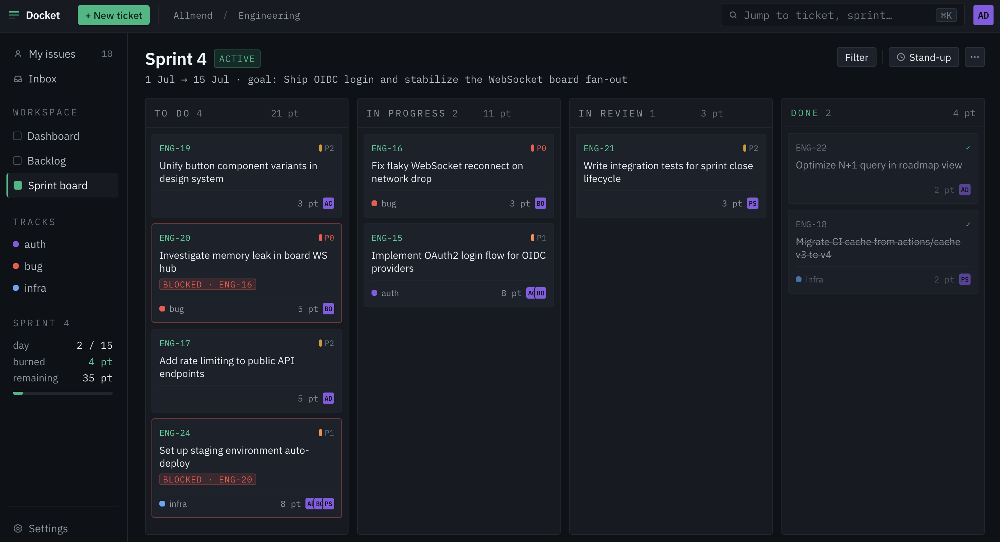

# Docket

> ⚠️ **This is alpha software.** Expect bugs, missing features, and breaking changes. Not recommended for production use yet.

Docket is a lightweight, self-hostable Scrum-first ticket and task management tool for engineering teams. An open-source alternative to Linear, Jira, and Shortcut — built close to the Scrum Guide, without the billion settings.

Part of the [Allmend](https://github.com/allmend) suite of open-source tools.



---

## Features

- Teams, boards, and tickets with display IDs (`ENG-42`)
- Kanban and Scrum board modes
- Sprint lifecycle — planning, active, close with Sprint Goal
- Product backlog with drag-to-reorder and bulk sprint assignment
- Sprint capacity planning — per-member focus percentage
- Roadmap — all sprints with progress bars and ticket lists
- Daily Scrum view — active sprint tickets grouped by assignee, with search and filter
- Backlog refinement view — side-by-side ticket list and detail, arrow key navigation, readiness indicator
- Definition of Done — board-level checklist with per-ticket check state
- Acceptance criteria with interactive checkboxes
- Story points
- Ticket detail with inline editing, Markdown support, and syntax highlighting
- Dual-mode rich text editor (Visual / Code) with `@mention` and `#ticket` autocomplete
- Assignees, priority, status, tags/labels
- Comments with `@mention` and `#ticket` linking and autocomplete
- Scoped API tokens (`metrics:read` / `api:read` / `api:write`) for the JSON API under `/api/v1`
- Ticket linking (blocks / relates to)
- Sprint review and retrospective board
- Notification inbox
- Full-text ticket search (`/` to focus)
- User management with admin/member roles
- Ticket and comment history
- Prometheus metrics endpoint (`/metrics`)
- Keyboard shortcuts (`?` for help)

---

## Tech stack

Go · PostgreSQL · HTMX · Alpine.js · Tailwind CSS · Chi

Single binary. No JS framework. Server-side rendered. Fast.

---

## Deploy

### Docker Compose

The quickest way to self-host.

```bash
curl -O https://raw.githubusercontent.com/allmend/docket/main/deploy/docker-compose.yml
```

Create a `.env` file next to it:

```env
JWT_SECRET=replace-with-a-long-random-string
SEED_PASSWORD=changeme
```

Then start:

```bash
docker compose up -d
```

Open `http://localhost:8081` and log in with `admin` / the password you set in `SEED_PASSWORD`.

Full list of environment variables:

| Variable | Default | Description |
|---|---|---|
| `JWT_SECRET` | — | **Required.** Long random string for signing sessions. |
| `DATABASE_URL` | *(postgres service)* | PostgreSQL connection string. |
| `HTTP_PORT` | `8081` | Port the app listens on. |
| `METRICS_PORT` | `9412` | Prometheus metrics port. |
| `MODE` | `all` | `all`, `api`, or `worker`. Single-instance deployments use `all`. |
| `SEED_ORG_NAME` | `My Team` | Organisation name, set on first run. |
| `SEED_ORG_SLUG` | `myteam` | Organisation slug, set on first run. |
| `SEED_USERNAME` | `admin` | Admin username, set on first run. |
| `SEED_NAME` | `Admin` | Admin display name, set on first run. |
| `SEED_EMAIL` | `admin@example.com` | Admin email, set on first run. |
| `SEED_PASSWORD` | `changeme` | Admin password, set on first run. |

`SEED_*` values only apply on the very first startup — once the org exists they are ignored.

### Kubernetes

Manifests are in [`deploy/k8s/`](deploy/k8s/). Apply in order:

```bash
kubectl apply -f deploy/k8s/namespace.yaml

# Copy secret.yaml, fill in your values, then apply
kubectl apply -f deploy/k8s/secret.yaml

kubectl apply -f deploy/k8s/deployment.yaml
kubectl apply -f deploy/k8s/service.yaml
kubectl apply -f deploy/k8s/ingress.yaml   # adjust host + ingressClassName first
```

The deployment runs 2 replicas behind a ClusterIP service. The ingress example uses nginx and cert-manager — adjust the annotations for your cluster. A `ServiceMonitor` for Prometheus Operator is included in `service.yaml`.

---

## Local development

**Requirements:** Go 1.25+, PostgreSQL 16+, Node.js 22+

```bash
# Start dependencies (Postgres + Mailpit)
make docker-up

# Build frontend assets
npm ci
make assets

# Run
go run ./cmd/serve
```

On first start, a default org and admin user are created automatically:

```
org slug: allmend
username: admin
password: changeme
```

To watch for CSS/JS changes during development:

```bash
make css-watch   # in one terminal
make js-watch    # in another
```

---

## Building

```bash
make rebuild     # vet + assets + binary
make build       # binary only
make assets      # Tailwind CSS + esbuild JS
```

To build and push a Docker image:

```bash
docker build -f docker/Dockerfile -t docket .
```

Every `v*` tag triggers GitHub Actions to build the container image, push it to `ghcr.io/allmend/docket` (`x.y.z`, `x.y`, and `latest` tags), and publish a [GitHub Release](https://github.com/allmend/docket/releases) with notes from the [CHANGELOG](CHANGELOG.md). The image is a ~24 MB distroless build containing everything it needs — binary, migrations, templates, and static assets.

---

## Contributing

Issues and pull requests welcome — see [CONTRIBUTING.md](CONTRIBUTING.md) for the dev setup, conventions, and the contributor agreement.

---

## License

[AGPL-3.0](LICENSE) — free software, no feature gating, self-hosting is free forever. Hosting Docket as a service for others carries the AGPL's source-disclosure obligations and may not use the Docket name — see [COMMERCIAL.md](COMMERCIAL.md) for the full picture and commercial licensing.

Copyright © 2026 the Docket contributors.
